# Physio Clinic

Physio Clinic is a full-stack web application designed to allow clients to browse physiotherapists, book appointments, and manage their bookings. Physiotherapists can view and manage their schedules, block time periods, and add internal notes.

This README outlines the project, features, deployment details, user instructions, technologies used, and how to contribute or test locally.

---

## Project Overview

Physio Clinic is a medical appointment scheduling platform with the following goals:

- Provide a client-friendly booking experience
- Support physiotherapists in managing their schedules
- Ensure secure authentication and role-based views
- Offer an intuitive, mobile-friendly interface

This project implements CRUD functionality for bookings and slots, Agile methodology tracking, and appropriate user stories.

---

## Deployed Application

The application is deployed to Heroku and can be accessed at:

**https://physio-clinic-d609e92202b3.herokuapp.com/**

---

## User Login Details

The following users are available for mentor testing. Use these credentials to explore role-specific functionality:

**Physiotherapist Accounts**

| Specialization                | Username      | Password          |
| ----------------------------- | ------------- | ----------------- |
| Orthopedic Physical Therapy   | `lilia_kraft` | `VaDhLQ@Xx3DP3d@` |
| Neurological Physical Therapy | `anna_levski` | `2EhLA@vFJ77CqsL` |
| Geriatric Physical Therapy    | `melissa_kel` | `6Gpy6pULUaSi@Ry` |

> Note: Client accounts can be created via the registration page.

---

## Features

### User Authentication

- Register new client accounts
- Login with role-based redirects (client or physiotherapist)
- Logout with CSRF protection

### Client Functionality

- Browse available physiotherapists
- View available slots per therapist
- Book an appointment with a required note
- View upcoming appointments in dashboard
- Cancel bookings

### Physiotherapist Functionality

- View upcoming slots and bookings
- Block time periods with reason (vacation, lunch, etc.)
- Cancel client bookings
- Add internal notes per booked slot
- Unblock slots

### Common UI and UX

- Responsive design using Bootstrap
- Navigation header with role-aware links
- Message alerts for success/warning feedback

---

## Screenshots

| Description                                                                                 | Screenshot                                                             |
| ------------------------------------------------------------------------------------------- | ---------------------------------------------------------------------- |
| **Home Page** – Landing page displaying clinic introduction and available physiotherapists. | 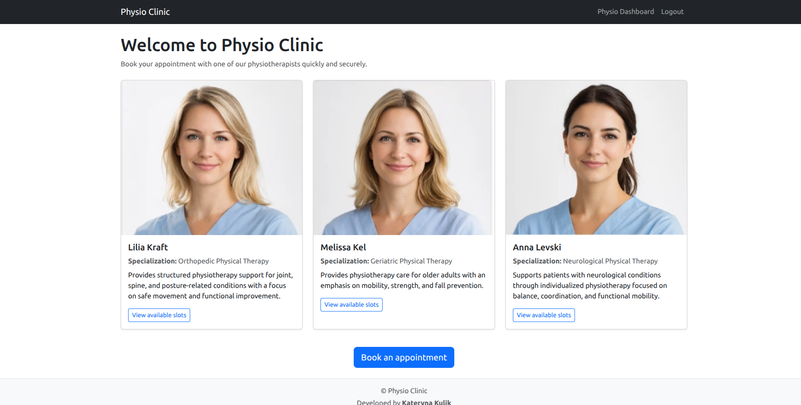                         |
| **User Registration** – New users can create an account to book appointments.               | 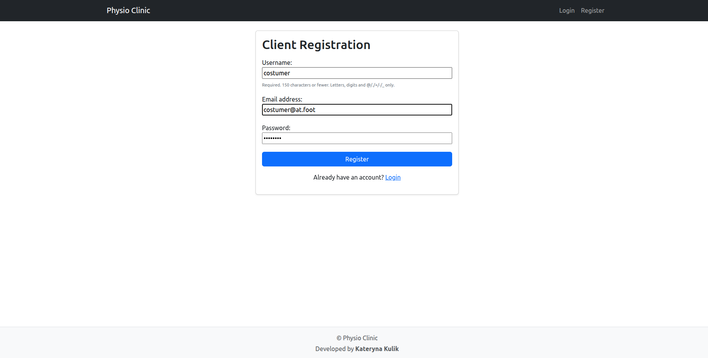                 |
| **User Login** – Secure login page for registered users.                                    | 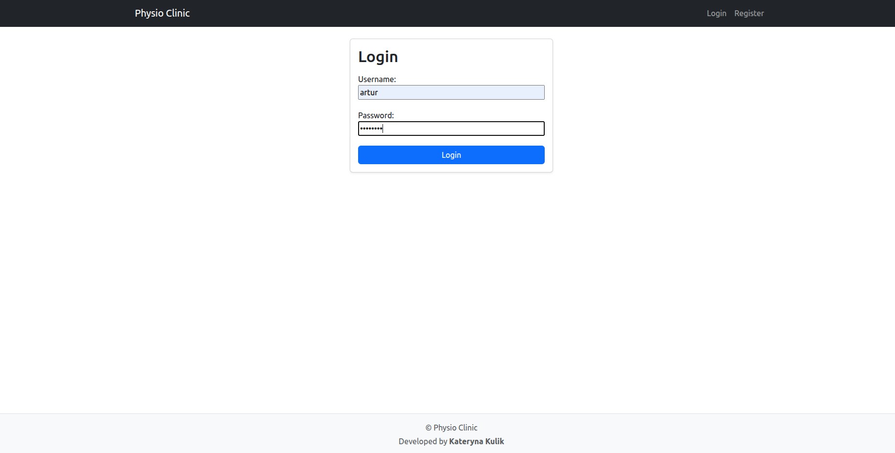                           |
| **Client Dashboard** – Clients can view and manage their upcoming bookings.                 |           |
| **Booking Page** – Displays available physiotherapists and appointment slots.               | 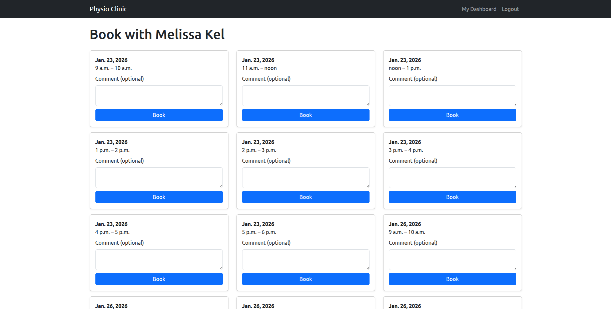                  |
| **Physiotherapist Dashboard** – Physiotherapists manage schedules and bookings.             | 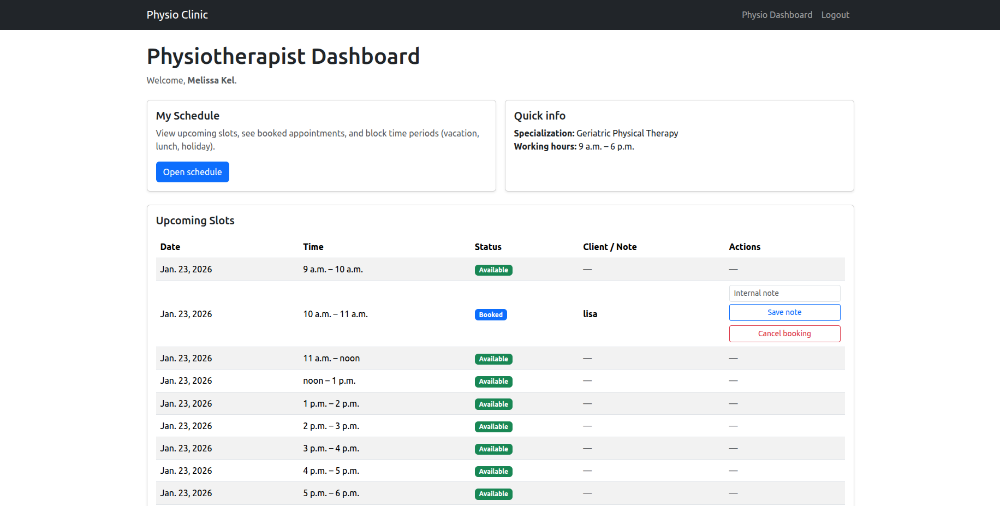 |
| **Schedule Management** – View, cancel, or unblock individual time slots.                   | 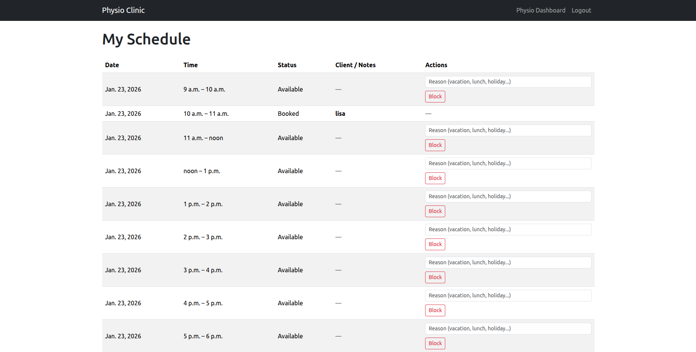        |
| **Responsive Design** – The application layout adapts correctly to mobile devices.          |

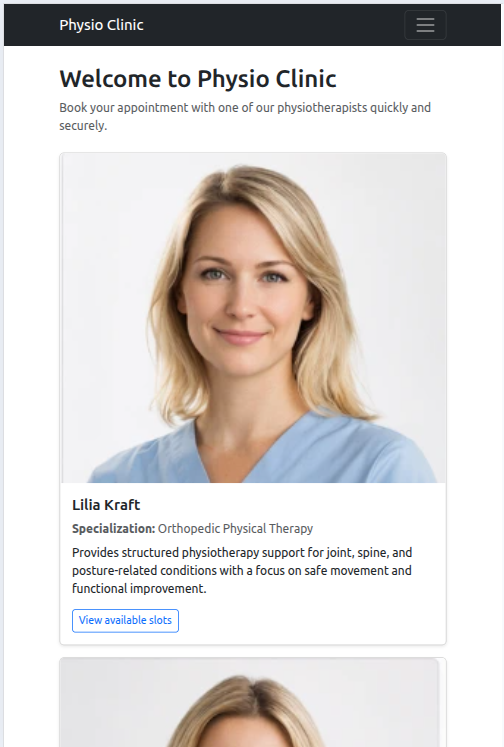 
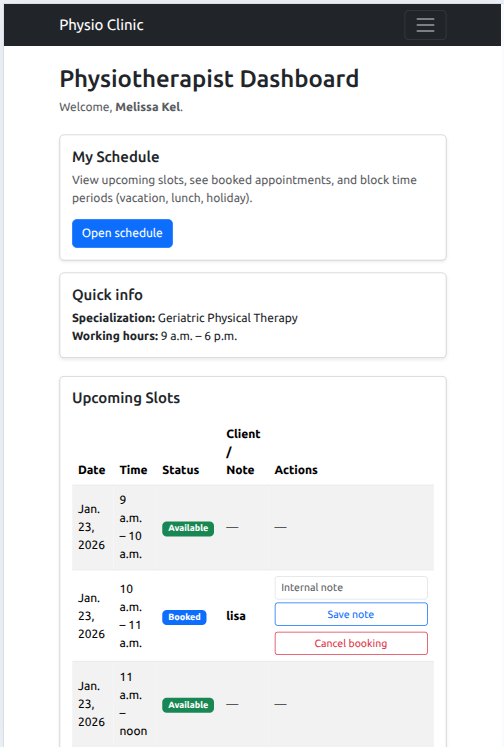 
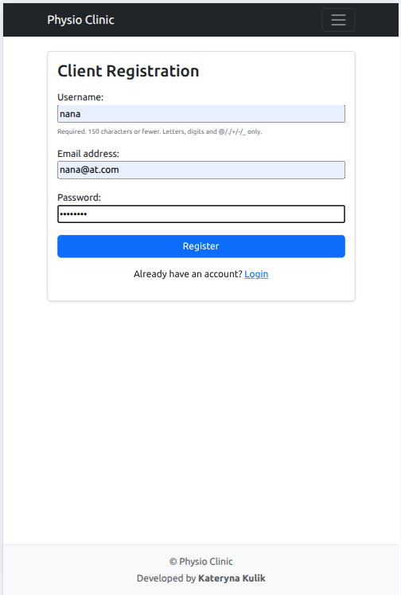 
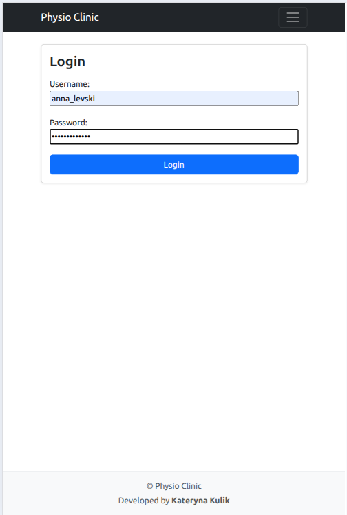 
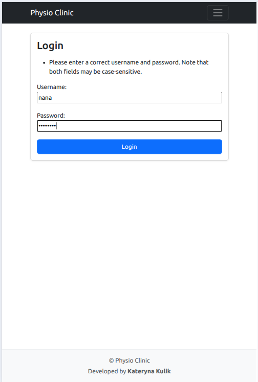 
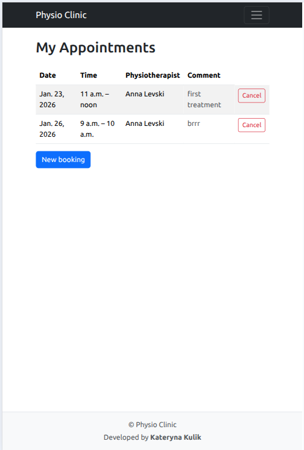 |

## Technologies Used

**Backend**

- Python 3
- Django 5.2
- Django ORM
- Gunicorn (production server)
- dj-database-url

**Frontend**

- HTML5
- CSS3 & Bootstrap 5
- Django templates

**Deployment**

- Heroku
- WhiteNoise (static files management)

**Database**

- PostgreSQL (via Heroku Postgres)

---

## Testing

This section documents the manual testing process carried out to validate the functionality, usability, and performance of the Physio Clinic application.  
All tests were planned in advance and executed step by step during development and after deployment.

---

### Functionality Testing

| Test Label               | Test Action                            | Expected Outcome                                                      | Test Outcome |
| ------------------------ | -------------------------------------- | --------------------------------------------------------------------- | ------------ |
| Homepage Load            | Open the deployed application          | Homepage loads with list of physiotherapists and navigation menu      | PASS         |
| User Registration        | Register a new client account          | User account is created and user is redirected to login               | PASS         |
| User Login               | Log in with valid client credentials   | User is logged in and redirected to client dashboard                  | PASS         |
| Invalid Login            | Log in with invalid credentials        | Error message is displayed, login denied                              | PASS         |
| Physiotherapist Cards    | View physiotherapist cards on homepage | Each card displays name, specialization, description, and image       | PASS         |
| Booking Page Access      | Click “View available slots”           | User is redirected to physiotherapist booking page                    | PASS         |
| Slot Availability        | View available time slots              | Only future, available slots are displayed                            | PASS         |
| Slot Booking             | Book an available slot with a comment  | Slot status changes to “Booked” and disappears from availability list | PASS         |
| Empty Comment Validation | Attempt to book without a comment      | Booking is prevented and warning message is shown                     | PASS         |
| Past Time Restriction    | Attempt to book a past time slot       | Booking is blocked                                                    | PASS         |
| Client Dashboard         | View client dashboard                  | User sees upcoming booked appointments                                | PASS         |
| Physiotherapist Login    | Log in as physiotherapist              | User is redirected to physiotherapist dashboard                       | PASS         |
| Physiotherapist Schedule | Open physiotherapist schedule          | All slots with correct statuses are displayed                         | PASS         |
| Cancel Booking (Physio)  | Cancel a booked slot                   | Slot becomes available again, client note is cleared                  | PASS         |
| Block Slot               | Block a time slot                      | Slot status changes to “Blocked” and is unavailable for booking       | PASS         |
| Logout                   | Log out from application               | User is logged out and redirected to homepage                         | PASS         |
| Authorization            | Access restricted pages without login  | User is redirected to login page                                      | PASS         |

---

### ⚡ Lighthouse Testing

Lighthouse audits were performed using **Google Chrome DevTools** on the deployed application.

| Page Tested    | Screenshot File                                          | Notes                  |
| -------------- | -------------------------------------------------------- | ---------------------- |
| Homepage       | 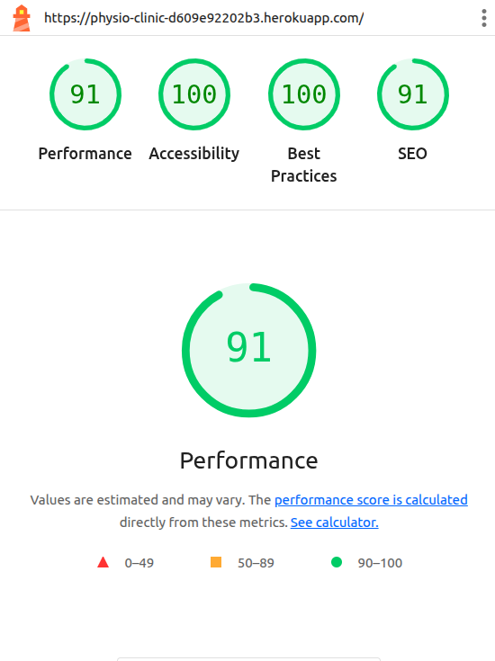    | All scores above 90%   |
| Booking Page   | 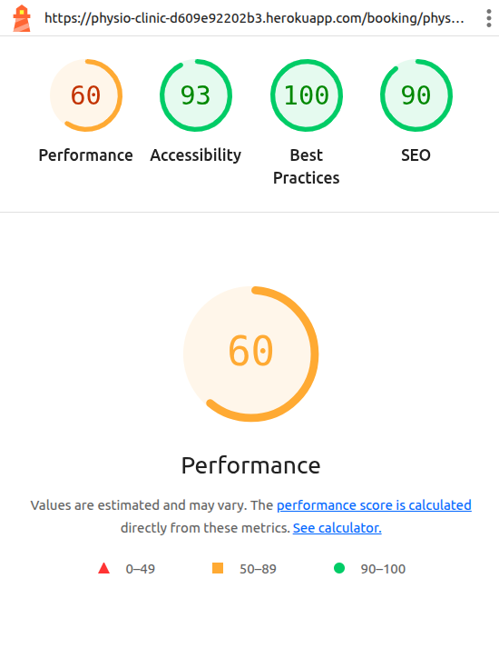 | Dynamic content tested |
| Dashboard Page | 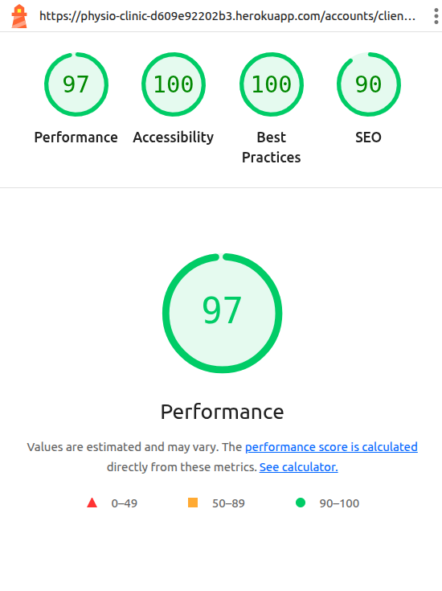    | Authenticated view     |

All Lighthouse scores achieved **90% or higher** in:

- Performance
- Accessibility
- Best Practices
- SEO

---

### Browser Compatibility Testing

The application was tested on the following browsers:

| Browser         | Result |
| --------------- | ------ |
| Google Chrome   | PASS   |
| Mozilla Firefox | PASS   |
| Microsoft Edge  | PASS   |
| Mobile Chrome   | PASS   |

---

### Known Issues

- No critical bugs detected at the time of submission.
- Minor UI differences may occur on very small screen widths, but functionality remains unaffected.

## Credits

### Content

All textual content used in this project, including physiotherapist descriptions, short bios, and interface copy, was generated with the assistance of artificial intelligence (AI).  
The content is fictional and intended solely for educational and demonstration purposes.

### Images

All images of physiotherapists displayed in this project were generated using artificial intelligence (AI).  
These images do not represent real individuals. Any resemblance to real persons, living or deceased, is purely coincidental.

The use of AI-generated images and content ensures that no real individuals are misrepresented and that no personal data is used without consent.

### Ethical Considerations

This project was developed as part of an educational portfolio.  
To avoid misinformation and the misuse of real identities, all names, images, and professional descriptions are fictional and AI-generated.

No real medical advice is provided by this application.

---

## Local Deployment

To run this project locally:

1. Clone the repository

```bash
git clone https://github.com/Katerynakulik/physio-clinic.git
cd physio-clinic
```

2. Create and activate a virtual environment

```bash
python3 -m venv venv
source venv/bin/activate
```

3. Install dependencies

```bash
pip install -r requirements.txt
```

4. Create .env file based on .env.example, including:

```bash
DEBUG=True
SECRET_KEY=<your secret key>
DATABASE_URL=sqlite:///db.sqlite3
```

5. Run migrations

```bash
python3 manage.py migrate
```

6. Run development server

```bash
python3 manage.py runserver
```

7. Visit http://127.0.0.1:8000/ in your browser

## Conclusion & Mentor Evaluation

The **Physio Clinic** project successfully demonstrates a well-structured, full-stack Django application that meets the core requirements of a Full-Stack Toolkit portfolio project.

### Strengths of the Project

- **Clear CRUD implementation**
  - Clients can create, read, and delete bookings.
  - Physiotherapists can update slot statuses, unblock slots, and manage schedules.
  - Slot notes are properly handled and cleared when bookings are cancelled.

- **Role-based user experience**
  - Clients and physiotherapists have clearly separated dashboards.
  - Access control is enforced both in views and UI navigation.

- **User experience and validation**
  - Booking past time slots is prevented.
  - Booking without a required comment is blocked with user feedback.
  - Visual status indicators (Available / Booked / Blocked) improve usability.

- **Responsive and accessible design**
  - The application adapts well across desktop, tablet, and mobile devices.
  - Lighthouse scores above 90% demonstrate good performance, accessibility, and SEO practices.
